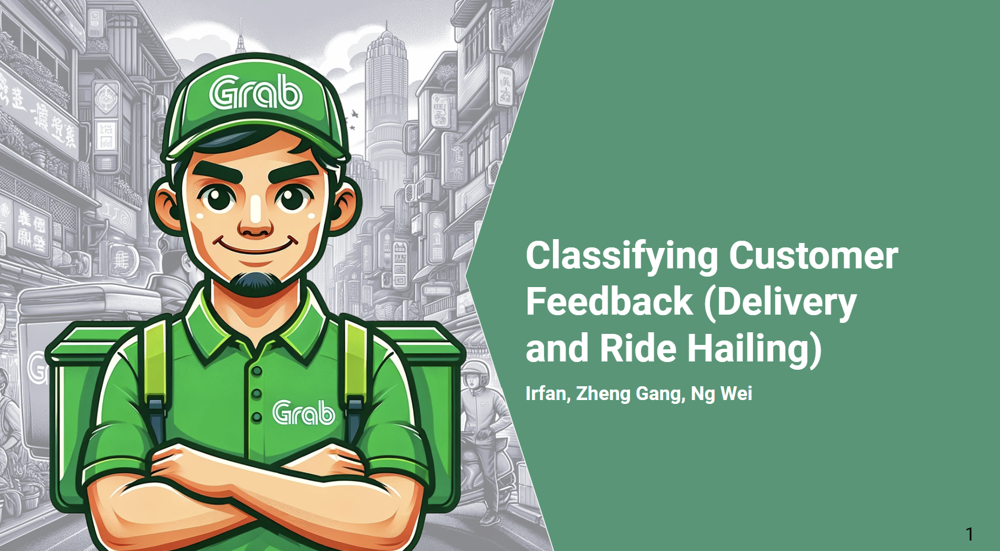

# About Me

📧 zhenggang91@gmail.com

### Profile
- Certified Analytical Professional by Singapore Management University.
- Data Science Graduate (expected May 2024) from General Assembly.
- Passionate about leveraging data for innovation, enhancing teamwork, and making data-driven decisions.
- Currently serving as Head of Operations at Kosmo Tech, with a prior role as Head of Logistics at foodpanda SG.

### Education

Bachelor of Science (Hons) - National University of Singapore  
Double Major in Applied Mathematics and Economics.

### Skills

- SQL
- Operations Management
- Statistical Analysis, Machine Learning
- Python

# Portfolio

**Robo Sommelier: Bridging the gap with competitors**

The projected rise in wine consumption has led to the proliferation of wine cellars and boutiques, yet supermarkets, including NTUC, often lack expert staff, impacting customer experiences. To address this gap, our project proposes a personalized wine recommender system coupled with a chatbot. This system integrates a content-based recommender to tackle cold start issues, a collaborative filtering model using the Surprise library to refine suggestions, and a chatbot powered by OpenAI Assistant API to offer real-time, personalized recommendations and support. Anchored by the Singular Value Decomposition (SVD) model, our solution aims to provide tailored wine suggestions and knowledgeable assistance, enhancing the overall supermarket experience. Despite observed biases, such as under-reporting and purchasing bias, our model's performance underscores its reliability and accuracy, particularly for ratings above 2.0. Moving forward, we recommend exploring Spotlight for validation and addressing system limitations through alternative metrics or hybrid approaches. In conclusion, our collaborative filtering recommender system seeks to revolutionize the wine selection process, improving customer satisfaction and competitiveness in the wines market.

View the interactive Streamlit app here: [Wine Recommendation System and ChatBot](https://winerecommender-capstone.streamlit.app/)

**Unveiling Chronic Disease in Singaporean Lifestyle**

This project targets the relationship between lifestyle habits and chronic disease risks. Our mission is to leverage data science for identifying individuals at high risk based on their behaviors, aiming for early detection and personalized health strategies.
We'll analyze lifestyle data, such as alcohol consumption, smoking habits, dietary patterns, physical activity, and other health metrics, to pinpoint risk factors. Through data cleaning and preparation, we set the stage for exploratory data analysis (EDA) and predictive modeling. Our objective is to offer tailored recommendations, empowering individuals to make informed decisions. This approach embodies a proactive stance towards health, using data-driven insights to foster a healthier society by mitigating chronic disease risks.

After prediction, we also work on a food recommender that recommend dishes that suits the users' nutrional requirements. The food recommender is in a beta version as there are limited nutritional data available online.

View the interactive Streamlit app here: [Chronic Risk Classifier and Food Recommendation System](https://healthapp-chroniscope-demo.streamlit.app/)

**Delivery and Ride Hailing Classifer**

Utilizing Natural Language Processing techniques on the uberEATS and uber subreddits, our team developed classifier models employing Naive Bayes, K Nearest Neighbours, and Logistic Regression algorithms. After comprehensive evaluation, we determined the Naive Bayes model to be the most effective, boasting an accuracy score of 77.7%. Subsequently, we integrated this model into our application, which efficiently categorizes Grab reviews on the Google Play Store into delivery and ride-hailing segments. This application facilitates swift and precise classification of reviews. Ng Wei and [Irfan Muzafar](https://irfanmuzafar.github.io/) made significant contributions to this project.

View the interactive Streamlit app here: [Delivery and Ride Hailing Classifier](https://dsi-42-project3-nhd8nmmbaulvgavhcbsoky.streamlit.app/)

**Singapore Housing Price Estimation with High Accuracy**

Implemented Lasso and Ridge regression models, achieving R-squared of 0.90 in Singapore housing price prediction. This project involved extensive data cleansing, normalization, and feature engineering, optimizing for predictive accuracy. Developed a Streamlit application for real-time model interaction, showcasing model performance metrics and dynamic price forecast visualization. This work was collaboratively undertaken with Eugene Matthew Cheong and Pius Yee, contributing significantly to the project's success.

View the interactive Streamlit app here: [Singapore Housing Price Prediction App](https://housepricepredmaster-mz37suvhp8fcmtsfpmsgka.streamlit.app/)

